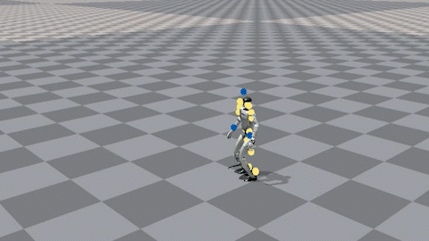
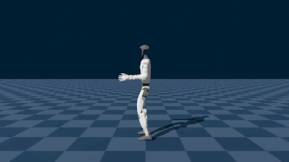
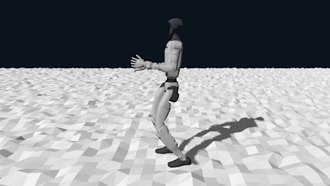
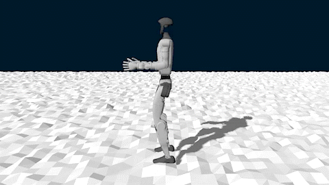
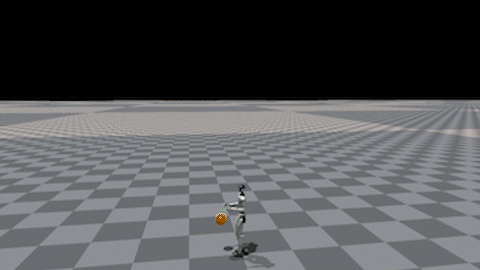

  <b>English</b> | <a href="README_CN.md">中文</a>

# ASAP-G1-Learning: G1 Reinforcement Learning and Sim2Sim Experiments

This project is built on top of [ASAP](https://github.com/LeCAR-Lab/ASAP). It records my experiments on **Unitree G1** motion imitation, reinforcement learning, cross-physics-engine validation, and football juggling / ball-control task design.

Rather than simply adding more features, this project focuses on several core questions:

- Imitating complex human motions on G1
- Sim2Sim validation from Isaac Gym to Genesis / MuJoCo
- How rewards, termination conditions, and control parameters affect learned behaviors
- Building and redesigning RL environments for football kickup / juggling tasks
- Small residual-action compensation for physics mismatch

> The original ASAP documentation is kept as `README_ORIGIN.md`. Please refer to it for basic installation and usage instructions.

---

## Results

### 1. CR7 Siuuu Motion Imitation

With a 0.85 motor torque soft limit and domain randomization, G1 can complete a relatively full motion sequence: **run-up → jump and turn → arm swing in the air → landing**.

| Isaac Gym (training) | Genesis (validation) |
| :---: | :---: |
|  |  |

### 2. Rough Terrain Adaptation

After training a basic walking policy in Isaac Gym, the policy was tested zero-shot on rough terrain in Genesis. The early policy often tripped over obstacles; later reward adjustments improved leg lifting and terrain-crossing stability.

| Before optimization | After optimization |
| :---: | :---: |
|  |  |

### 3. G1 Football Juggling Task (Ongoing)

This is the current main task line. The goal is not merely to make the robot touch the ball, but to gradually train a more sustainable ball-control behavior:

> When the ball leaves the controllable region in front of the robot, the robot should use a corrective touch to send it back into that region.

Current progress:

- Built the minimal `robot + ball` simulation pipeline
- Added ball state, contact detection, and debug logs based on Isaac Gym tensors
- Implemented the initial single-hit / kickup environment and rewards
- Trained early policies that can kick the ball upward
- After removing overly hard ground-contact termination, the policy can control the ball closer to the target height
- Some rollouts already show second swing attempts, which suggests early signs of continuous correction behavior

| Ball reaches a reasonable height, but the posture is still unnatural | A second swing attempt appears, despite poor style |
| :---: | :---: |
|  |  |

Main issues at this stage:

- The first kick can lift the ball, but the motion is still unnatural
- The body posture and support state after the first kick are not suitable for a second kick
- Immediate termination when the ball touches the ground encourages the policy to kick the ball too high
- The next step is to turn “can kick the ball up” into “can kick the ball up and return to a ready pose for the next touch”

The current direction is therefore to first train a usable **kickup / recovery primitive**, and then gradually add continuability, height control, direction control, and motion-style constraints. At this stage, I am not yet evaluating Sim2Sim feasibility or the real-world physical feasibility of foot juggling on the actual robot. The current objective is only to make the basic juggling behavior work in the training environment.

---

## Main Technical Work

### Motion Imitation and Reward Tuning

For high-dynamic motion imitation on G1, I mainly worked on the following aspects:

- Introduced `soft_torque_curriculum`: the torque limit is relaxed early to help the policy explore jumping, then gradually reduced back to the 0.85 soft torque limit.
- Addressed the “single-foot sticking to the ground” local optimum by adjusting fall penalties and foot-tracking rewards, encouraging real double-foot takeoff.
- Increased `penalty_action_rate` to suppress high-frequency arm and joint oscillations during takeoff and landing.
- Added `penalty_feet_ori` to encourage flatter and more stable foot orientation during landing.
- Used high-noise checkpoint continuation to increase exploration again from an existing policy, improving motion stiffness and insufficient jump height.

### Sim2Sim Validation Pipeline

To check whether the policy was merely overfitting Isaac Gym, I completed several cross-engine testing components:

- Added `humanoidverse/export_pt_to_onnx.py` to export trained policies to ONNX.
- Built `genesis_simulation/` to load and test ONNX policies in Genesis.
- Compared jump height, stability, and landing behavior between Isaac Gym and Genesis, revealing that contact, damping, and integration differences strongly affect high-dynamic motions.
- Re-enabled domain randomization, which significantly improved stability in Genesis.
- Completed the MuJoCo ONNX inference pipeline and aligned key parameters such as control frequency, action filtering, and target-rate limits.

### Football Task Environment and Task Redesign

The football task initially used a single-hit design: the robot prepares, swings its leg, touches the ball, and receives a score based on the post-contact ball height. This version was useful for building the basic pipeline, but several problems became clear:

- The task was easily reduced to a one-shot kick scoring problem
- The reward became fragmented as more patches were added
- The policy tended to exploit proxy solutions such as toe-hooking, sideways kicks, or kicking the ball too high
- After a successful first kick, the body posture often failed to transition naturally into a second kick

The task was therefore reframed as **maintaining the ball inside a controllable region in front of the robot**:

- When the ball is inside the target state region, the policy is rewarded for maintaining it there
- When the ball leaves the region and starts falling, a corrective touch is needed
- The purpose of contact is not simply to kick the ball higher, but to send it back into a sustainable control region
- The focus shifts from “whether the robot touches the ball” to contact quality, outgoing ball trajectory, post-kick recovery, and continuability for the next touch

The current intermediate objective is:

> Turn a single kickup into a stable recovery primitive: when the ball gets too low, the robot can kick it up, avoid large horizontal drift, and return to a ready state for the next touch.

### Residual Patch Experiments (Brief)

The residual patch experiments study physics mismatch compensation when transferring an Isaac Gym policy to Genesis. The core question is:

> If the same action produces different state transitions in two physics engines, can a small action patch reduce the Sim2Sim gap?

Early attempts used PPO to learn the residual directly, but sample efficiency was poor and the policy often produced high-frequency oscillation or conservative compensation. Later, I switched to computing a local oracle residual first:

$$
\Delta a^* = (J^\top W J + \lambda I)^{-1} J^\top W r
$$

The oracle residual was then distilled into a small network with lower-body masking, deadzone filtering, and amplitude limits.

Current conclusions:

- The residual patch is effective for one-step gap reduction. After removing confounding factors, the error was reduced from about `2.02` to `1.81`.
- In closed-loop execution, high `K_p` can amplify residual jitter, causing torque spikes and unnatural motion.
- Residual actions are therefore more suitable for **small, low-frequency, conservative local correction**, not large-scale motion replanning.
- This line is kept as a Sim2Sim dynamics-compensation experiment, but it is no longer the main route for the football juggling task.

---

## Current Focus

The next stage mainly focuses on the football control task:

- [ ] Keep the kickup direction and stabilize the single recovery primitive first.
- [ ] Replace immediate ground-contact termination with softer penalty / delayed termination to avoid over-kicking.
- [ ] Add recoverability metrics after the first kick: torso stability, support stability, swing-leg recovery, and next-touch ready pose.
- [ ] Measure the minimum ball-foot distance during second swing attempts to identify whether the problem is timing, trajectory, or observation.
- [ ] Add local ball-relative-to-foot observations to reduce blind leg swinging.
- [ ] After functional behavior becomes stable, gradually add motion prior / weak tracking as a style constraint.
- [ ] Continue improving Genesis / MuJoCo Sim2Sim testing to evaluate cross-engine generalization.

---

## Acknowledgements

Thanks to the [ASAP](https://github.com/LeCAR-Lab/ASAP) team for open-sourcing a strong embodied intelligence training framework.  
This project is mainly for my personal learning and experiments in reinforcement learning, robot control, and cross-physics-engine validation.
