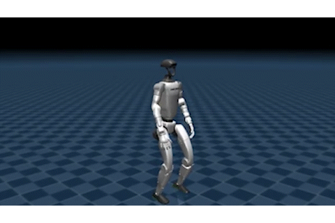
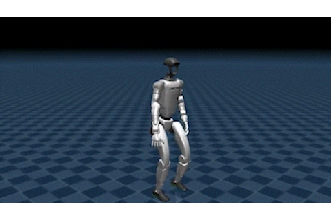

  <b>English</b> | <a href="README_CN.md">中文</a>

# ASAP-G1-Learning: G1 Reinforcement Learning and Sim2Sim Experiments

This project is built on top of [ASAP](https://github.com/LeCAR-Lab/ASAP). It records my experiments on **Unitree G1** motion imitation, reinforcement learning, cross-physics-engine validation, ASAP delta action reproduction, and football kickup / juggling task design.

Rather than simply adding more features, this project focuses on several core questions:

- Motion tracking for complex human motions on G1
- Sim2Sim validation from Isaac Gym to Genesis / MuJoCo
- Locomotion, motion imitation, and contact-stability tuning
- ASAP delta action data collection, open-loop training, and closed-loop fine-tuning
- RL environment construction and task redesign for football kickup / juggling

> The original ASAP documentation is kept as `README_ORIGIN.md`. Please refer to it for basic installation and usage instructions.

---

## Results

### 1. CR7 Siuuu Motion Imitation

With a 0.85 motor torque soft limit and domain randomization, G1 can complete a relatively full motion sequence: **run-up → jump and turn → arm swing in the air → landing**.

| Isaac Gym (training) | Genesis (validation) |
| :---: | :---: |
|  |  |

### 2. Rough-terrain Locomotion

After training a basic walking policy in Isaac Gym, the policy was tested zero-shot on rough terrain in Genesis. The early policy often tripped over obstacles; later reward adjustments improved leg lifting and terrain-crossing stability.

| Before optimization | After optimization |
| :---: | :---: |
|  |  |

### 3. ASAP Delta Action Residual: MuJoCo-to-IsaacGym Sim2Sim

This part reproduces the residual-action idea of ASAP in a **Sim2Sim** setting. Instead of using real-world G1 rollout data, I use MuJoCo as the target dynamics environment and Isaac Gym as the training simulator.

The goal is:

> Learn a frozen delta action model from MuJoCo rollout data, inject it into Isaac Gym as a dynamics correction, and then fine-tune the original motion-tracking policy in the corrected simulator.

#### Open-loop deltaA evaluation

The open-loop deltaA model is trained with MuJoCo rollout-with-action data. During deterministic evaluation, Isaac Gym replays the MuJoCo action sequence with or without the learned residual correction.

The paper-style open-loop metrics show that ankle-only deltaA can strongly reduce MuJoCo-to-IsaacGym replay error:

| Metric | Zero delta | Deterministic deltaA | Improvement |
| :--- | ---: | ---: | ---: |
| Eg-mpjpe (mm) | 1038.984 | 82.724 | 92.04% |
| Empjpe (mm) | 316.271 | 40.539 | 87.18% |
| Eacc (mm/frame²) | 7.569 | 4.559 | 39.77% |
| Evel (mm/frame) | 24.483 | 6.484 | 73.51% |
| **Paper mean improvement** | - | - | **73.13%** |
| **Paper normalized improvement** | - | - | **73.13%** |

These numbers are used to verify that the deltaA model is not merely outputting arbitrary residuals, but can actually reduce target-state matching error in open-loop replay.

#### Closed-loop fine-tuning

The closed-loop stage is the final part of the ASAP-style residual pipeline. The frozen deltaA model is injected into Isaac Gym as a simulator correction, while the main motion-tracking policy is fine-tuned. During MuJoCo deployment, only the fine-tuned main policy is used; the deltaA model is not deployed.

A key issue found during reproduction was that the original closed-loop configuration was not equivalent to baseline motion-tracking continuation even when `delta_action_scale=0`. This caused policy drift, especially around ankle and hip actions. To fix this, I rebuilt a **baseline-equivalent closed-loop** configuration:

- Baseline motion-tracking reward and PPO settings are kept.
- The main actor observation remains unchanged.
- The frozen deltaA model is injected only through the corrected action path.
- When `delta_action_scale=0`, the closed-loop path degenerates to ordinary baseline continuation.
- Nonzero delta scales are then tested conservatively.

The best current closed-loop candidate uses:

- `delta_action_mask_mode = ankle_only`
- `delta_action_scale = 0.05`
- frozen open-loop deltaA checkpoint: `model_6000.pt`
- fine-tuned main policy checkpoint: `model_13100.pt`

The MuJoCo closed-loop evaluation for `scale=0.05` gives:

| Metric | Closed-loop scale=0.05 |
| :--- | ---: |
| Eg-mpjpe | 317.775 |
| Empjpe | 207.820 |
| Eacc | 27.935 |
| Evel | 31.004 |
| **Paper mean improvement vs baseline** | **22.79%** |

The resulting MuJoCo rollout remains visually stable, while a larger scale such as `0.15` becomes noticeably worse. This suggests that the residual correction scale must remain conservative in closed-loop fine-tuning.

| Baseline MuJoCo rollout | Closed-loop scale=0.05 MuJoCo rollout |
| :---: | :---: |
|  |  |

This is not presented as a full real-world ASAP reproduction. It is a Sim2Sim reproduction of the residual pipeline: MuJoCo rollout collection, ankle-only open-loop deltaA training, paper-style open-loop evaluation, baseline-equivalent closed-loop fine-tuning, and MuJoCo deployment evaluation.

### 4. G1 Football Kickup / Juggling Task (Ongoing)

This is the current main task line. The goal is not merely to make the robot touch the ball, but to gradually train a more sustainable ball-control behavior:

> When the ball leaves the controllable region in front of the robot, the robot should use a corrective touch to send it back into that region.

Current progress:

- Built the minimal `robot + ball` simulation pipeline
- Added ball state, contact detection, and debug logs based on Isaac Gym tensors
- Implemented the initial single-hit / kickup environment and rewards
- Trained early policies that can kick the ball upward
- After removing overly hard ground-contact termination, the policy can control the ball closer to the target height
- Some rollouts already show second swing attempts, which suggests early signs of continuous correction behavior

| Ball reaches a reasonable height, but the posture is still unnatural | A second swing attempt appears |
| :---: | :---: |
|  |  |

The task is still exploratory and has not achieved stable continuous juggling. The current intermediate goal is to obtain a robust **kickup / recovery primitive**: when the ball becomes too low, the robot can kick it up, avoid large horizontal drift, and return to a ready state for the next touch. Continuability, height control, direction control, and motion-style constraints will be added progressively.

See detailed notes: [Technical Summary](docs/football_juggling_summary.md)

---

## Main Technical Work

### Motion Tracking and Reward Tuning

For high-dynamic motion imitation on G1, I mainly worked on the following aspects:

- Introduced `soft_torque_curriculum`: the torque limit is relaxed early to help the policy explore jumping, then gradually reduced back to the 0.85 soft torque limit.
- Addressed the “single-foot sticking to the ground” local optimum by adjusting fall penalties and foot-tracking rewards, encouraging real double-foot takeoff.
- Increased `penalty_action_rate` to suppress high-frequency arm and joint oscillations during takeoff and landing.
- Added `penalty_feet_ori` to encourage flatter and more stable foot orientation during landing.
- Used high-noise checkpoint continuation to increase exploration again from an existing policy, improving motion stiffness and insufficient jump height.

### Locomotion and Rough-terrain Testing

To evaluate basic walking ability and cross-engine generalization, I also trained a G1 locomotion policy and tested it on rough terrain in Genesis:

- Trained a basic locomotion policy in Isaac Gym.
- Exported the policy to ONNX and tested it zero-shot in Genesis.
- Observed early failures such as insufficient foot clearance, foot-obstacle collision, and unstable landing.
- Improved terrain-crossing stability by adjusting foot-height, contact-stability, and landing-related rewards.

### Sim2Sim Validation Pipeline

To check whether the policy was merely overfitting Isaac Gym, I completed several cross-engine testing components:

- Added `humanoidverse/export_pt_to_onnx.py` to export trained policies to ONNX.
- Built `genesis_simulation/` to load and test ONNX policies in Genesis.
- Compared jump height, stability, and landing behavior between Isaac Gym and Genesis, revealing that contact, damping, and integration differences strongly affect high-dynamic motions.
- Re-enabled domain randomization, which significantly improved stability in Genesis.
- Completed the MuJoCo ONNX inference pipeline and aligned key parameters such as control frequency, action filtering, target-rate limits, and policy action semantics.

### ASAP Delta Action Reproduction

This part focuses on the delta action stage in ASAP. Unlike the older “analytic residual / oracle patch” notes, the current implementation follows a more faithful data-driven route: rollout-with-action data collection, open-loop deltaA training, deterministic evaluation, and closed-loop fine-tuning.

#### Why delta action is needed

A motion-tracking policy trained in Isaac Gym may behave differently in another simulator or on real hardware. The same policy action can lead to different next states because of differences in contact, damping, integration, motor modeling, and body dynamics.

The delta action model is trained to compensate for this dynamics gap. It does not replace the original policy action. Instead, it predicts a correction:

`final_action = base_action + delta_action`

In open-loop training, `base_action` comes from the recorded target rollout. In closed-loop fine-tuning, `base_action` comes from the trainable main policy.

#### Rollout-with-action data collection

The original motion pkl only contains reference motion states. It does not contain the policy action that produced a target rollout. Therefore, I added a rollout logger to generate `motion_with_action.pkl` files containing:

- root state
- DoF position and velocity
- body position and velocity
- body rotation
- 23-DoF policy action

This is necessary because deltaA training requires both the target state transition and the action that was executed.

#### Open-loop deltaA training

For the Sim2Sim residual experiment, I exported the CR7 motion-tracking policy to ONNX and rolled it out in MuJoCo to obtain a MuJoCo target trajectory. Then I trained a deltaA model in Isaac Gym to make Isaac Gym better match the MuJoCo transition.

The open-loop evaluation compares:

- **Zero delta:** execute the recorded MuJoCo action in Isaac Gym.
- **Deterministic deltaA:** execute recorded MuJoCo action plus the deterministic residual action.

A key implementation detail is that PPO sampled actions are not used for deterministic evaluation. The actor mean is used instead, avoiding confusion between exploration noise and learned residual correction.

The best ankle-only open-loop checkpoint achieved the following paper-style deterministic replay result:

| Metric | Zero delta | Deterministic deltaA | Improvement |
| :--- | ---: | ---: | ---: |
| Eg-mpjpe (mm) | 1038.984 | 82.724 | 92.04% |
| Empjpe (mm) | 316.271 | 40.539 | 87.18% |
| Eacc (mm/frame²) | 7.569 | 4.559 | 39.77% |
| Evel (mm/frame) | 24.483 | 6.484 | 73.51% |
| **Paper mean improvement** | - | - | **73.13%** |

This result shows that the learned ankle-only residual can strongly reduce MuJoCo-to-IsaacGym open-loop replay error.

#### Why ankle-only residual

Full-body 23-DoF residuals can improve root and body pose tracking, but they also tend to introduce side effects in DoF velocity and closed-loop stability. In contrast, ankle-only residuals are more local and conservative, and are closer to the real-world setting discussed in ASAP.

The implemented ankle-only residual mask keeps only four residual dimensions active:

- left ankle pitch
- left ankle roll
- right ankle pitch
- right ankle roll

The main motion action remains 23-dimensional. Only the residual correction is masked.

#### Closed-loop fine-tuning

The initial closed-loop attempt was unstable because the old closed-loop configuration was not equivalent to baseline motion-tracking continuation, even when `delta_action_scale=0`. It used different environment settings, reset behavior, termination settings, reward weights, and PPO hyperparameters. This caused policy drift even when the frozen deltaA correction was effectively disabled.

I therefore rebuilt a **baseline-equivalent closed-loop** setting. The key sanity check is:

`delta_action_scale = 0` should reduce closed-loop training to ordinary baseline motion-tracking continuation.

After this equivalence check passed, I tested small residual scales. The most stable candidate so far is `delta_action_scale=0.05`.

MuJoCo closed-loop deployment result for `scale=0.05`:

| Metric | Value |
| :--- | ---: |
| Eg-mpjpe | 317.775 |
| Empjpe | 207.820 |
| Eacc | 27.935 |
| Evel | 31.004 |
| Paper mean improvement vs baseline | 22.79% |
| Ankle action drift vs baseline | 1.470 |
| Hip action drift vs baseline | 0.964 |
| Action rate | 3.431 |

The closed-loop result is visually stable in MuJoCo, while a larger scale such as `0.15` becomes worse. This indicates that the closed-loop residual correction must be introduced conservatively. The current result is therefore best described as a stable preliminary Sim2Sim closed-loop candidate, not as a complete real-world ASAP reproduction.

#### Current residual conclusion

Current status:

- Open-loop MuJoCo-to-IsaacGym deltaA is effective under paper-style replay metrics.
- Ankle-only residual is more stable than full-body residual.
- Closed-loop fine-tuning is highly sensitive to baseline equivalence and residual scale.
- The baseline-equivalent closed-loop setting fixes the scale=0 drift problem.
- `delta_action_scale=0.05` gives a stable MuJoCo candidate with positive paper-style improvement.
- Larger correction scales can cause ankle / hip action drift and MuJoCo instability.

This part is therefore kept as an **ASAP delta action Sim2Sim reproduction study**, not as a complete real-world reproduction.

### Football Task Environment and Task Redesign

The football task initially used a single-hit design: the robot prepares, swings its leg, touches the ball, and receives a score based on the post-contact ball height. This version was useful for building the basic pipeline, but several problems became clear:

- The task was easily reduced to a one-shot kick scoring problem
- The reward became fragmented as more patches were added
- After a successful first kick, the body posture often failed to transition naturally into a second kick
- Purely optimizing height can reduce recoverability for the next touch

The task was therefore reframed as **maintaining the ball inside a controllable region in front of the robot**:

- When the ball is inside the target state region, the policy is rewarded for maintaining it there.
- When the ball leaves the region and starts falling, a corrective touch is needed.
- The purpose of contact is not simply to kick the ball higher, but to send it back into a sustainable control region.
- The focus shifts from “whether the robot touches the ball” to contact quality, outgoing ball trajectory, post-kick recovery, and continuability for the next touch.

The future training interface will be structured into several layers: the functional objective defines whether the ball returns to the controllable region, contact geometry defines whether the touch is physically reasonable, motion prior controls naturalness, and hard constraints remove unstable behaviors.

---

## Current Focus

The next stage mainly focuses on football control and residual reproduction wrap-up:

- [ ] Keep the kickup direction and stabilize the single recovery primitive first.
- [ ] Replace immediate ground-contact termination with softer penalty / delayed termination to avoid over-kicking.
- [ ] Add recoverability metrics after the first kick: torso stability, support stability, swing-leg recovery, and next-touch ready pose.
- [ ] Measure the minimum ball-foot distance during second swing attempts to identify whether the problem is timing, trajectory, or observation.
- [ ] Add local ball-relative-to-foot observations to reduce blind leg swinging.
- [ ] Continue reframing the task from “single-hit scoring” into “maintaining the ball inside a front controllable region”, with height, direction, and next-ready-state constraints.
- [ ] Continue scale sweep for baseline-equivalent closed-loop residual fine-tuning.
- [ ] Reduce ankle / hip action drift during closed-loop fine-tuning through smaller residual scales, early stopping, or action regularization.
- [ ] Continue improving Genesis / MuJoCo Sim2Sim testing to evaluate cross-engine generalization.

---

## Acknowledgements

Thanks to the [ASAP](https://github.com/LeCAR-Lab/ASAP) team for open-sourcing a strong embodied intelligence training framework.  
This project is mainly for my personal learning and experiments in reinforcement learning, robot control, and cross-physics-engine validation.